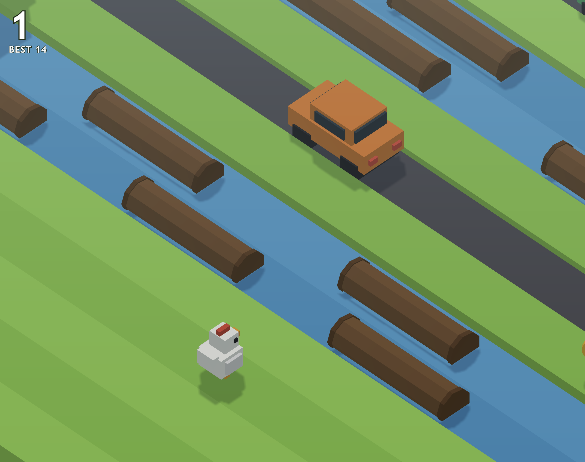

# Rohit's Road

An endless voxel road-crossing arcade game in the style of *Crossy Road*, built
with Three.js. Hop forward across grass, freeways, rivers and railroads for as
long as you can. Stop moving for too long and the eagle comes for you.

No art assets, no textures to download, no loading screen — every model, colour
and texture in the game is generated in code at startup.



## Running it

```bash
npm install
npm run dev
```

Then open the URL Vite prints (usually `http://localhost:5173`).

| Command | What it does |
| --- | --- |
| `npm run dev` | Dev server with hot reload |
| `npm run build` | Production bundle into `dist/` |
| `npm run preview` | Serve the production bundle locally |

## Controls

Forward is up the screen, away from the camera.

| Input | Action |
| --- | --- |
| `↑` / `W` / `Space` | Hop forward |
| `↓` / `S` | Hop back |
| `←` `→` / `A` `D` | Hop sideways |
| Tap | Hop forward |
| Swipe | Hop in the swiped direction |

Your score is the furthest row you have reached, and it only counts forward
progress — backtracking and returning does not score twice. Best score and
collected coins persist in `localStorage`.

## How it works

The game is plain ES modules with no framework. Each file owns one concern:

| File | Responsibility |
| --- | --- |
| `src/main.js` | Renderer, lights, sky, resize handling, the single animation loop |
| `src/game.js` | State machine (title → playing → dying → over), collisions, scoring, the eagle |
| `src/world.js` | Row generation, streaming, traffic and train simulation |
| `src/models.js` | Every mesh, procedural texture, and the object pools |
| `src/player.js` | Hop arcs, squash-and-stretch, log riding, death animations |
| `src/camera.js` | Fixed-angle orthographic rig that follows the player |
| `src/input.js` | Keyboard and swipe handling with a small input buffer |
| `src/constants.js` | Tuning values and the colour palette |
| `src/audio.js` | Sound effects synthesised with the Web Audio API |
| `src/hud.js` | Score, coins and overlay DOM updates |

### Orthographic camera

An orthographic camera at a fixed angle keeps the world reading as a flat toy
diorama — parallel lines stay parallel no matter where the player is, which is
what gives the genre its look. The frustum height is fixed in world units and
widens on tall screens so phones never see a uselessly narrow slice.

### Endless world streaming

Rows are generated ahead of the player and recycled behind. The generator works
in bands rather than picking a type per row: it commits to a run of 1–4 roads or
1–3 river rows at a time, then inserts grass as breathing room. Rivers and
railroads never sit directly against each other, though roads may.

Difficulty ramps over the first ~170 rows, widening the odds of roads and
railroads while narrowing the gaps between vehicles.

### Object pooling

Nothing is allocated during play. Cars, trucks, logs, trees, hedges, coins,
trains, rails and even the row slabs come from free lists, and every mesh shares
a cached geometry and material. Recycling a row returns its contents to the
pools rather than creating garbage, which is what keeps the frame time flat
during a long run.

### Traffic as wrapping convoys

Each road picks a direction, a speed and a vehicle type, then spaces N vehicles
evenly around a fixed 48-tile loop with a little jitter. Positions advance by a
single phase value and wrap. Because spacing is baked in at generation time, a
car can never spawn on top of another one, and traffic entering the screen looks
like it has been driving the whole time.

### Rivers

Logs use the same convoy model at slower speeds. Landing on one attaches the
player with a fixed offset so they ride along at a fractional column position;
hopping off snaps back to the nearest lane. Drift past the edge of the playfield
and you are washed away. Some rivers use static lily pads instead.

### Railroads

Each railroad row runs an idle → warning → train cycle. The crossing signals
alternate their lamps for 1.6 seconds before a train crosses at 27 tiles per
second, which is the only warning you get.

## Known gaps

- **Camera angle.** Measuring a real *Crossy Road* frame shows its rows run
  downhill to the right at about 14.6°, implying roughly a 26° yaw and a 33°
  pitch. This build currently sits near 34°, so the world reads as more steeply
  isometric than the original. The fix is in `CAMERA.offset` in
  `src/constants.js`.
- **Palette.** The reference asphalt is a light blue-grey (`#485361`) with
  `#717A8F` lane dashes, and its grass is a yellower green (`#AAC928` /
  `#AED967`) than what is used here. Water in the original is a brighter cyan
  (`#5FCAFC`) and logs are a dark red-brown (`#7C4344`).
- No character selection, no gift/lottery machine, and no themed worlds.

## How this was built

The whole game came out of a single agent session from four short prompts.
[`docs/PROMPT_LOG.md`](docs/PROMPT_LOG.md) has those prompts rewritten as a
step-by-step recipe, plus notes on what would have been worth specifying up
front.

## Credits

*Crossy Road* is a trademark of Hipster Whale. This is a personal
reimplementation built for learning, not affiliated with or endorsed by them.
